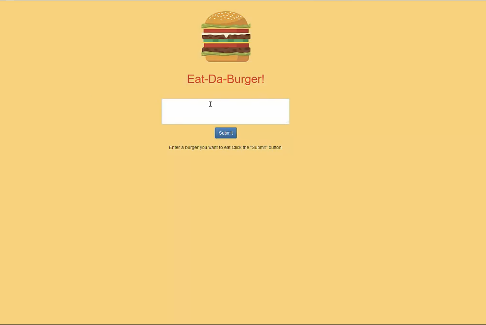
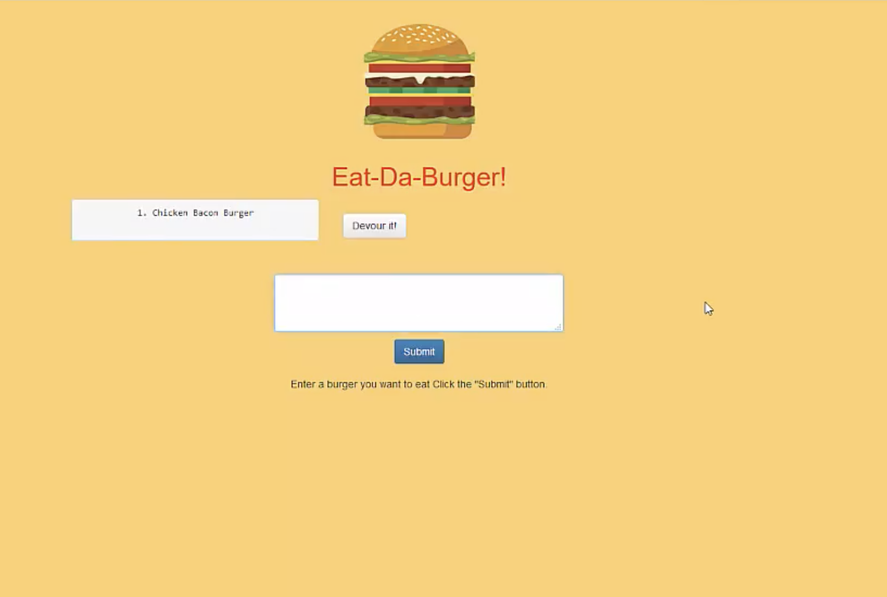
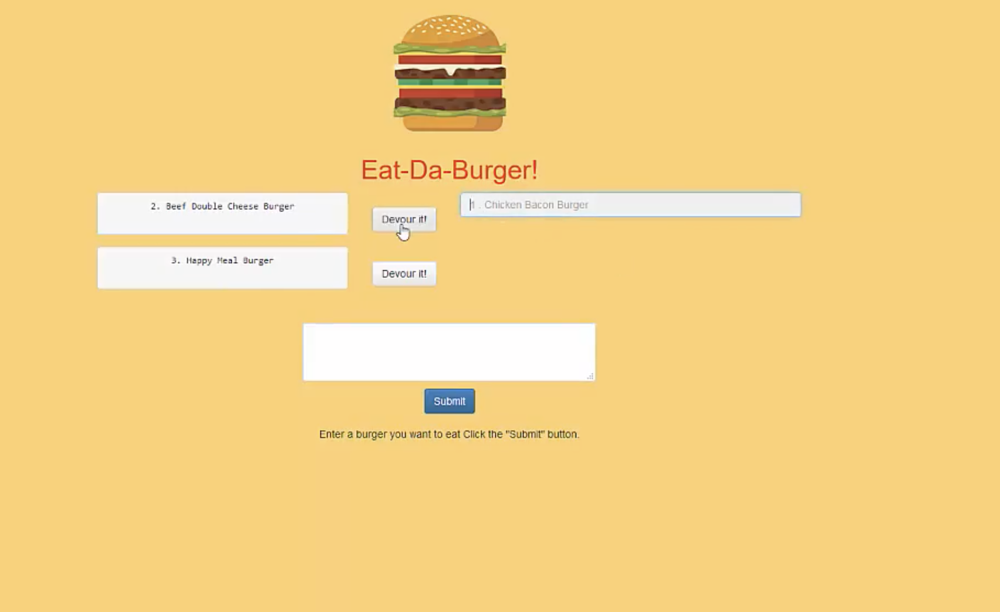

# Burger 

## Description

Eat Da Burger is an application that allows the user to build their own burger and demolish it too! When the user opens the page they are presented with a simple layout. There is a burger and underneath there is a small input box where they are able to enter the burger type of their choice. Once the burger is entered it is moved to the left side of the screen, if it is the user's first entry it will also has a number one next to it. As the user adds more burger types the list on the left hand side will increase. With each burger that is created, there will be a "devour" button created with it. When the user is ready to devour the burger they created they will click the devour button and the burger they selected will move to the right side of the page. That's it, sweet and simple layout. 

## Installation 

#### App Setup

1. Create a GitHub repo called `burger` and clone it to your computer.

2. Make a package.json file by running `npm init` from the command line.

3. Install the Express npm package: `npm install express`.

4. Create a server.js file.

5. Install the Handlebars npm package: `npm install express-handlebars`.

6. Install MySQL npm package: `npm install mysql`.

7. Require the following npm packages inside of the server.js file:
   * express

#### DB Setup

1. Inside your `burger` directory, create a folder named `db`.

2. In the `db` folder, create a file named `schema.sql`. Write SQL queries this file that do the following:

   * Create the `burgers_db`.
   * Switch to or use the `burgers_db`.
   * Create a `burgers` table with these fields:
     * **id**: an auto incrementing int that serves as the primary key.
     * **burger_name**: a string.
     * **devoured**: a boolean.

3. Still in the `db` folder, create a `seeds.sql` file. In this file, write insert queries to populate the `burgers` table with at least three entries.

4. Run the `schema.sql` and `seeds.sql` files into the mysql server from the command line

5. Now you're going to run these SQL files.

   * Make sure you're in the `db` folder of your app.

   * Start MySQL command line tool and login: `mysql -u root -p`.

   * With the `mysql>` command line tool running, enter the command `source schema.sql`. This will run your schema file and all of the queries in it -- in other words, you'll be creating your database.

   * Now insert the entries you defined in `seeds.sql` by running the file: `source seeds.sql`.

   * Close out of the MySQL command line tool: `exit`.

#### Config Setup

1. Inside your `burger` directory, create a folder named `config`.

2. Create a `connection.js` file inside `config` directory.

   * Inside the `connection.js` file, setup the code to connect Node to MySQL.

   * Export the connection.

3. Create an `orm.js` file inside `config` directory.

   * Import (require) `connection.js` into `orm.js`

   * In the `orm.js` file, create the methods that will execute the necessary MySQL commands in the controllers. These are the methods you will need to use in order to retrieve and store data in your database.

     * `selectAll()`
     * `insertOne()`
     * `updateOne()`

   * Export the ORM object in `module.exports`.

#### Model setup

* Inside your `burger` directory, create a folder named `models`.

  * In `models`, make a `burger.js` file.

    * Inside `burger.js`, import `orm.js` into `burger.js`

    * Also inside `burger.js`, create the code that will call the ORM functions using burger specific input for the ORM.

    * Export at the end of the `burger.js` file.

#### Controller setup

1. Inside your `burger` directory, create a folder named `controllers`.

2. In `controllers`, create the `burgers_controller.js` file.

3. Inside the `burgers_controller.js` file, import the following:

   * Express
   * `burger.js`

4. Create the `router` for the app, and export the `router` at the end of your file.

#### View setup

1. Inside your `burger` directory, create a folder named `views`.

   * Create the `index.handlebars` file inside `views` directory.

   * Create the `layouts` directory inside `views` directory.

     * Setup the `index.handlebars` to have the template that Handlebars can render onto.

     * Create a button in `index.handlebars` that will submit the user input into the database.

#### Directory structure

All the recommended files and directories from the steps above should look like the following structure:

```
.
├── config
│   ├── connection.js
│   └── orm.js
│ 
├── controllers
│   └── burgers_controller.js
│
├── db
│   ├── schema.sql
│   └── seeds.sql
│
├── models
│   └── burger.js
│ 
├── node_modules
│ 
├── package.json
│
├── public
│   └── assets
│       ├── css
│       │   └── burger_style.css
│       └── img
│           └── burger.png
│   
│
├── server.js
│
└── views
    ├── index.handlebars
    └── layouts
        └── main.handlebars
```
## Usage 

The following image is an example of the home page of the app: 


The following image displays the left hand list that creates when the user adds a burger:


The following images displays the right hand list that created when the user devours the burger: 



